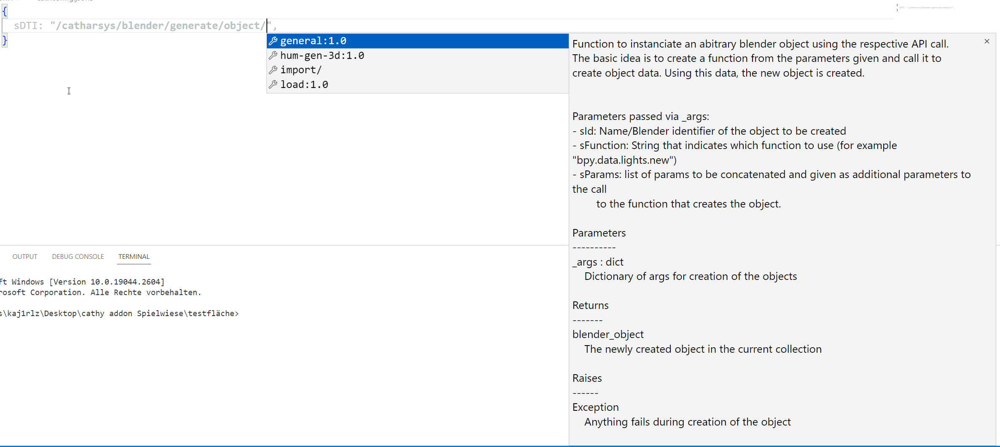
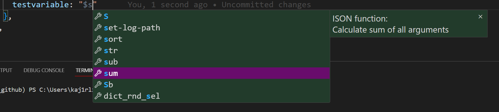

# Catharsys Language Support

This Addon provides language support for Catharsys projects.

## Features

- Catharsys sDTI and modifier support
  - Autocomplete support for catharsys sDTIs
    - 
  - Hover support showing the docstring of the modifier hovered over (same data as for autocomplete)
  - Autocomplete support for modifier parameters [mockup, requires changes on Catharsys side]
    - 
  - Definition link provider for Catharsys modifiers leading right to the sources where the modifier is installed (strg+click/f12)
- Catharsys inline functions support
  - Definition link provider for Catharsys inline functions (strg+click/f12)
  - Hover over tooltips for Catharsys inline functions
    
  - Autocompletion support
    
- Definition links for user defined catharsys variables (strg+click/f12)
- Side panel providing workspace outline, catharsys execution shortcuts and a cathy command stash

  - Overview of Workspace
    - Shortcut for cathy blender init (click the sun)
    - Shortcut for cathy ws launch -c <> -a <> (click the rocket)
    - Shortcut for cathy blender show -c <> -a <> (click the eye symbol)
    - Shortcut for cathy --debug ws launch [etc] (context menu on action)
    - Shortcut for cathy ws launch [etc] --config-only --config-vars (context menu on action)

  - Run stashed cathy commands: Any .json named "cathycommands.json" in the workspace is interpreted as collection of stashed shell commands, e.g. (click the Banana ^^)

    ```
    [
    "cathy ws launch -c .\\config\\group04\\dataset_13 -a render/std",
    "vcs pull",
    "echo hello"
    ]
    ```

    and shown in the sidepanel for quick access.

    

  - Installation status information, color coded information which modules are in feature branches, and whether the installation is up to date with the origin
    
    - Shortcut to "cathy repos update" in the side panel
    - Context menü shortcut to jump into installation folder of the module
    - Context menü allowing quick switching between branches in the individual modules
    
  - lsf status information over jobs, showing which jobs have are successfully completed, pending and crashed (Only visible if an lsf folder is present in the workspace)
    - Provides button to quickly delete all lsf logs of a group
      
    - Click job to open associated stdout.txt directly

- Support for cathy ws config copy build in context menü of the navigation panel.

  

- Support for cathy blender show -a <> -f in Explorer. .blend files have the right click context menu entry "Open with cathy blender show" which will executed cathy blender show on the .blend file, provided a catharsys config is selected in the side panel.

  

- Semantic tokens provider to enable hightlighting of known catharsys sDTIs, intermediate group sDTIs and unknown/user defined sDTIs. Add markup colors to your workspace .config:

  ```
      "editor.semanticTokenColorCustomizations": {
          "enabled": true, // enable for all themes
          "rules": {
              "sDTI.truesDTI": {
                  "foreground": "#455cd09d",
                  "fontStyle": "bold"
              },
              "sDTI.manualsDTI": {
                  "foreground": "#9e3db9a9"
              },
              "sDTI.groupsDTI": {
                  "foreground": "#b9c2c3"
              }
          }
      }
  ```

## Requirements

None

## Extension Settings

### Image-Render-Automation.condaenv

Configure name of the conda environment used in your catharsys installation.

### Image-Render-Automation.condapath

Only used when running on a Linux System.
Configure Conda installation path under linux. This setting can be necessary if conda is not found.


## Known Issues

This Readme is also displayed on the vscode Addons tab of vscode, but does not show images, read directly on github: https://github.com/boschresearch/image-render-vscode

## Release Notes

### 0.0.2

Feature complete version for Beta testing.

### 0.0.2

Feature complete version for Beta testing.

### 0.0.3

- Added side panel icon shortcut (eye) for cathy blender show to open the base blender file of an action with cathy (cathy blender show -c <> -a <>)
- Added context menu entry in the explorer to open a selected .blend file with cathy using the selected config in the side panel as context (cathy blender show -c <> -f <>)
- removed redundant configuration of python path

### 0.0.4

- Added Installation status information in sidepanel visualizing the installation status in the sense of whether the modules are in the main branch or not and whether the clones are up to date with origin or not.
- Added shortcut for cathy repos upate in the side panel
- Added lfs Status information in the sidepanel to give quick overview of started jobs and whether they terminated successfully or crashed (Only visible if an lfs folder is present in the workspace)
  - Added purge button to quickly delete all lsf logs of the selected group
  - Added quick navigation to stdout.txt files via click on the lsf subjob tree element in the sidepanel
- Made the Configs information in the sidepanel hiearchical mirroring the actual structure instead of a flat list.
- Added inline ISON autocompletion support

### 0.0.5
- Added context menu on actions providing running the action with added --debug flug
- Added context menu on actions providing running the action with added --config-only --config-vars flag
- Added context menu on modules allowing jumping into the installation folder and switching branches.
- Added Condapath setting to set the path explicitely under Linux

## Setting up a Development environment

Follow https://code.visualstudio.com/api/get-started/your-first-extension for base setup

run

```
npm install vsce
npm install -g @vscode/vsce
```

to get needed packages

### packaging

To compile into an installable .vsix package, run

```
vsce package --baseContentUrl "https://github.com/boschresearch/image-render-vscode"
```
